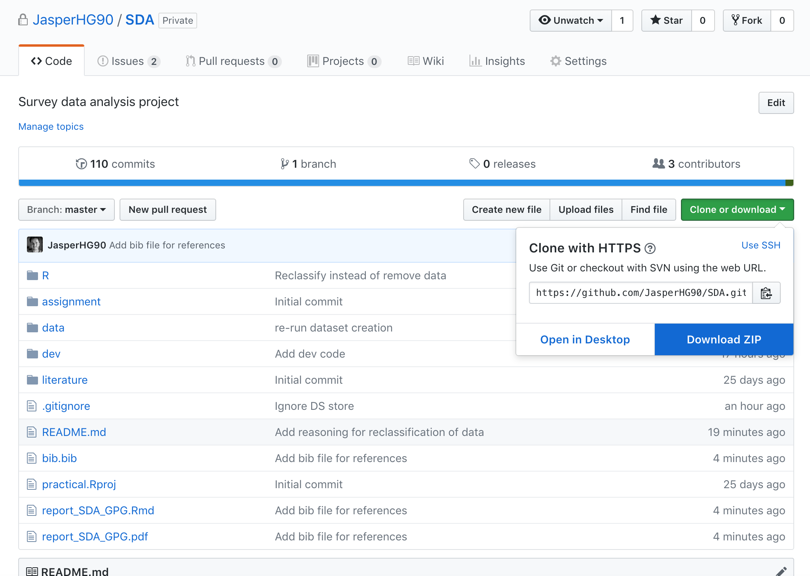

# Gender paygap project

This repository contains our project files for the course 'Survey Data Analysis' at Utrecht University. The analysis and code can be found in the [R markdown file](https://github.com/JasperHG90/SDA/blob/master/report_SDA_GPG.Rmd). 

We separated data preprocessing, dependency management and utility functions from the main analysis file and stored them in their own R files. These files are called in the Rmd file by using the `source()` function. For more information, see:

1. [install_dependencies.R](https://github.com/JasperHG90/SDA/blob/master/R/utilities/install_dependencies.R) for the R file that installs missing dependencies to the user's directory.
2. [preprocess_data.R](https://github.com/JasperHG90/SDA/blob/master/R/utilities/preprocess_data.R) for the R file that takes the [original dataset](https://github.com/JasperHG90/SDA/blob/master/data/gender_pay_gap.Rds) and preprocesses it such that it is ready to be used for analysis. This process will only be called **once** if the preprocessed data does not yet exist in the [data](https://github.com/JasperHG90/SDA/tree/master/data) folder.
3. [functions.R](https://github.com/JasperHG90/SDA/blob/master/R/utilities/functions.R) for the R file that defines utility functions (`stratify()`, `neyman()` and `sample_size()`) and their documentation.

The accompanying presentation for this project can be found [here](https://docs.google.com/presentation/d/13akRqr7Rc_xBN7ihqFFdrieKUvlg8HwmQgiHGjH_pWU/edit?usp=sharing)

## The data

The data were supplied to us by the course instructors. This data can be found [here](https://github.com/JasperHG90/SDA/blob/master/data/gender_pay_gap.Rds) and the original source of the data was retrieved from [dava.gov.uk](https://data.gov.uk/dataset/54219db1-dd98-49d9-a383-a5978bb0aeb9/gender-pay-gap). 

We augmented the data by extracting postal codes and counties. We did this because we wanted to examine if there was a difference between counties (especially London versus other countries). This did not turn out to be the case and the variables were not used in the analysis.

We further received a file containing Standard Industrial Codes (SIC). This file can be found [here](https://github.com/JasperHG90/SDA/blob/master/data/sicCodes.Rds). We merged this file with the paygap data to obtain labels for the SIC divisions.

We re-classified six companies because their classification did not correspond to their activities. These six companies, their new classification and the reason for their new classification are are shown below:

| uuid|company_name               |company_website                                                                             |sic_division_before_recoding                            |sic_division_after_recoding                                          |reason                                                         |
|----:|:--------------------------|:-------------------------------------------------------------------------------------------|:-------------------------------------------------------|:--------------------------------------------------------------------|:--------------------------------------------------------------|
| 2102|FISHKEEPER LIMITED         |https://www.fishkeeper.co.uk/#                                                              |ACTIVITIES OF EXTRATERRITORIAL ORGANISATIONS AND BODIES |WHOLESALE AND RETAIL TRADE; REPAIR OF MOTOR VEHICLES AND MOTORCYCLES |Retail of aquariums                                            |
| 2376|GOLDIE HOTELS (2) LIMITED  |https://www.bespokehotels.com/                                                              |ACTIVITIES OF EXTRATERRITORIAL ORGANISATIONS AND BODIES |ACCOMMODATION AND FOOD SERVICE ACTIVITIES                            |This is a hotel                                                |
| 2378|GOLDIE HOTELS (4) LIMITED  |https://www.bespokehotels.com/                                                              |ACTIVITIES OF EXTRATERRITORIAL ORGANISATIONS AND BODIES |ACCOMMODATION AND FOOD SERVICE ACTIVITIES                            |This is a hotel (same company as above but different building) |
| 2715|HOMES FOR HARINGEY LIMITED |https://www.homesforharingey.org/                                                           |ACTIVITIES OF HOUSEHOLDS AS EMPLOYERS                   |REAL ESTATE ACTIVITIES                                               |According to website, they manage real estate                  |
| 2913|INTERSERVE FS (UK) LIMITED |https://www.interserve.com/docs/default-source/about/policies/gender-pay-gap-march-2018.pdf |ACTIVITIES OF HOUSEHOLDS AS EMPLOYERS                   |CONSTRUCTION                                                         |Construction company according to the URL provided             |
| 5085|SILK HEALTHCARE LIMITED    |https://www.mha.org.uk                                                                      |ACTIVITIES OF HOUSEHOLDS AS EMPLOYERS                   |HUMAN HEALTH AND SOCIAL WORK ACTIVITIES                              |Healthcare company according to the URL                        |

The above table is stored as a separate data file called `reclassified.rds` and can be found in the [data](https://github.com/JasperHG90/SDA/tree/master/data) folder.

Finally, we added a column with the estimated number of employees ("NumEmp"). This value is based on the employer size ("EmployerSize") variable and is the midpoint of the range given by this variable. For example, if the value for EmployerSize is '500 to 999', then NumEmp value would be `(500 + 999) / 2`.

## Getting started

Clone this repository by downloading it as a zip file (under 'clone or download'). 



If you're using git, execute:

```shell
git clone https://github.com/JasperHG90/SDA.git
```

In a terminal or from the [GitHub desktop](https://desktop.github.com/) application.

You are **strongly** advised to download and use [R-studio](https://www.rstudio.com/). Once downloaded, navigate into the folder and open 'practical.Rproj' to open the project.

Should you want to recreate the data, you should remove the [gpg_core.rds](https://github.com/JasperHG90/SDA/blob/master/data/gpg_core.rds), [gpg_meta.rds](https://github.com/JasperHG90/SDA/blob/master/data/gpg_meta.rds) and [reclassified.rds](https://github.com/JasperHG90/SDA/blob/master/data/reclassified.rds) data files in the [data](https://github.com/JasperHG90/SDA/tree/master/data) folder. The next time that you run the analysis script and, in particular, the following line of code, the data will be re-created from the original datasets.

```{r}
# Line from report_SDA_GPG.rdm that you should rerun --> line 27
source("R/utilities/preprocess_data.R")
```

Re-creating the report requires `knitr` and an installation of `LaTeX`. The easiest way to install these dependencies is to execute

```r
install.packages(c("knitr", "tinytex"))
tinytex::install_tinytex()
```

## Making sense of the forward-operating pipe ('%>%')

The forward-operating pipe is a method of coding that allows you to 'pipe' results from one command to the next. It is exported by the [magrittr](https://cran.r-project.org/web/packages/magrittr/vignettes/magrittr.html) package and widely used in the [tidyverse](https://www.tidyverse.org/) set of R packages

Instead of doing something like this:

```r
library(dplyr)
mean(sample(1:1000, 5))
```

Where we take the mean of a random sample of numbers ranging from 1:1000, we can do this:

```r
sample(1:1000, 5) %>% 
  mean()
```

Which looks a LOT cleaner.  If you want to see what the intermediate output looks like (e.g. the results of the above after the sample() command), you can just comment the pipe out, like this:

```r
sample(1:1000, 5) #%>%
mean()
```

